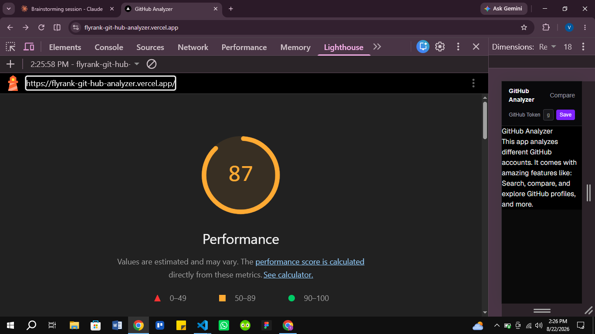
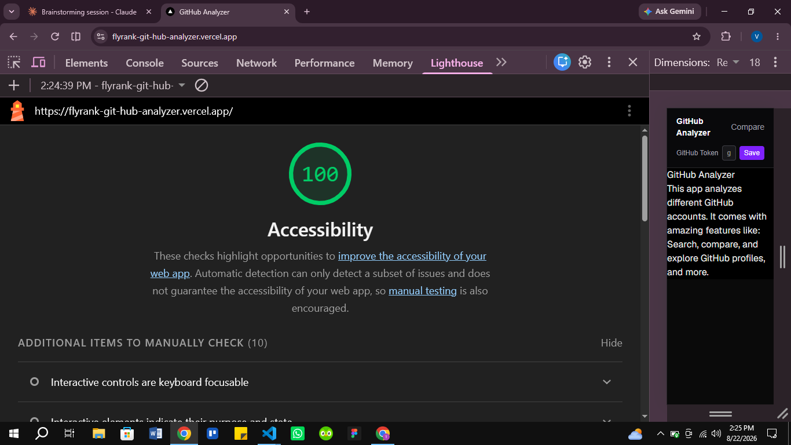

# Performance & Accessibility Audit

## Before

Lighthouse (mobile, live deployed URL: https://flyrank-git-hub-analyzer.vercel.app)

- **Performance: 85**
- **Accessibility: 95**
- **Best Practices: 100**
- **SEO: 100**

(An earlier run showed Performance 67, but Lighthouse itself flagged
that run as unreliable — "clearing the browser cache timed out" — so
85 is used as the honest baseline instead.)

Accessibility issue found: the "Save" button (`bg-violet-500` with
white text) failed color contrast requirements for normal-sized text.

## Changes made

- Darkened the accent button color project-wide from `violet-500` to
  `violet-600` (and hover state from `violet-400` to `violet-500`),
  restoring sufficient contrast against white button text.
- Confirmed AI-specific accessibility already in place from earlier
  work: `aria-live="polite"` and `aria-busy` on the Analyze button so
  streamed status is announced to screen readers, and the Stop button
  is reachable and operable via keyboard alone (Tab, then Enter/Space).
- Performed a manual keyboard-only pass through the primary flow
  (profile page → Tab to Analyze → Enter → Tab to Stop → Enter) —
  fully completable without a mouse.

## After

- **Performance: 87**
- **Accessibility: 100**
- **Best Practices: 100**
- **SEO: 100**

## Known gaps / what I'd do with more time

- WAVE was not run this session — the app is still actively being
  built, and a full WAVE pass makes more sense once the remaining
  capstone features (repo filtering, charts, comparison view) are in
  place, rather than auditing an intentionally partial app twice.
- Performance sits at 87, just under the 90 aspirational target. The
  code itself looks clean (no obvious unused/oversized JS beyond
  normal Next.js/Three.js library weight), and repeated clean runs
  landed in the 85-90 range — likely near the ceiling for this app's
  current feature set without deeper bundle-splitting work.