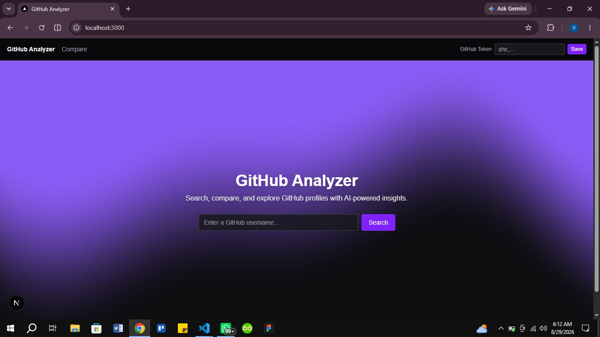
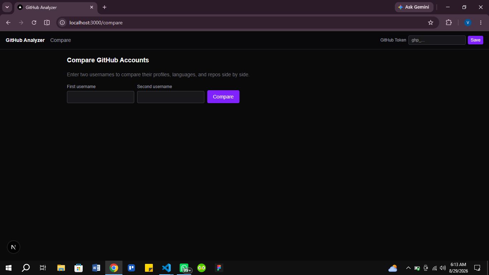
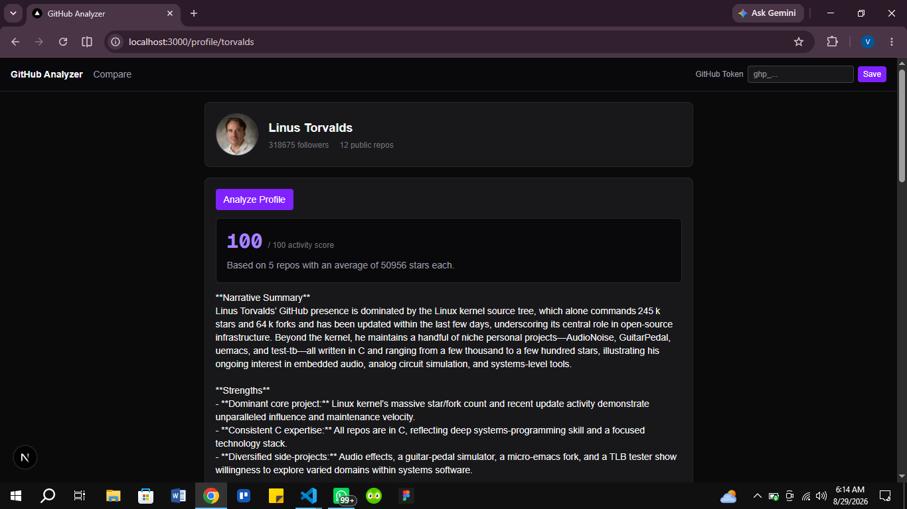
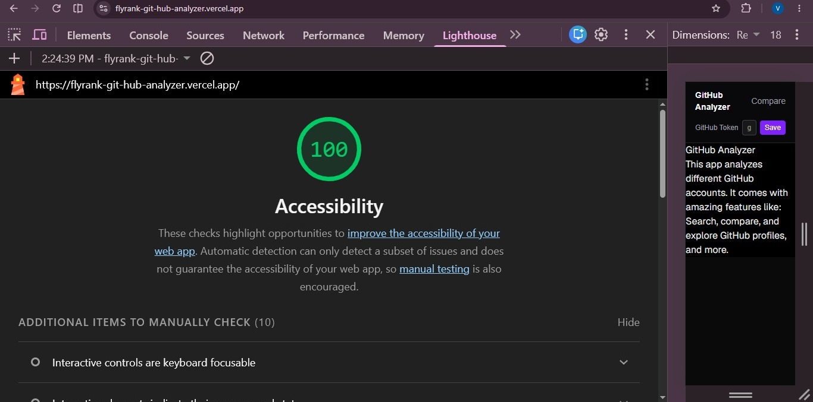
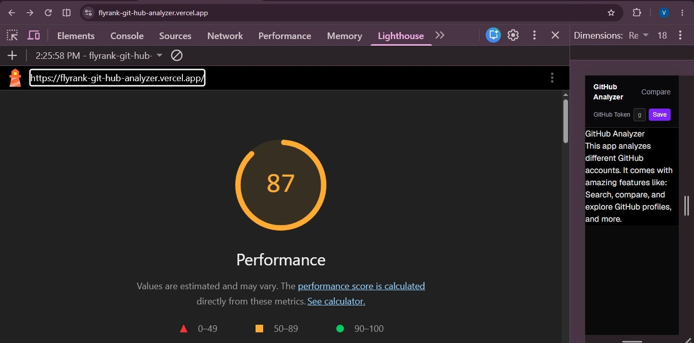

# GitHub Analyzer

A Next.js app that turns a GitHub username into a readable picture of
that developer — profile info, language breakdown, a filterable repo
list, and an AI-generated narrative summary with a computed activity
score. Two profiles can be compared side by side.

**Live URL:** https://flyrank-git-hub-analyzer.vercel.app

## Screenshots







## Features

- **Profile lookup** — search a GitHub username, see their avatar, bio, followers, and public repo count
- **Repo list** — sortable (stars, forks, last updated) and filterable by language
- **Language breakdown chart** — proportional bars showing a developer's primary languages
- **AI-generated summary** — a 2-3 sentence narrative plus strengths/gaps, generated from real repo data and a deterministic activity score computed by a server-side tool (not guessed by the model)
- **Comparison mode** — two profiles side by side, reusing the same components as the single-profile view
- **Optional GitHub token** — raises the API rate limit from 60/hour to 5,000/hour, saved locally in the browser
- **3D and shader demos** — a Three.js scene (`/3d-orb-demo`) and a custom GLSL shader hero (`/shader-hero-demo`), built as part of the program's frontend fundamentals track

## Getting Started

```bash
git clone https://github.com/Vic-toria-ai/Flyrank-GitHub-Analyzer.git
cd Flyrank-GitHub-Analyzer
git checkout capstone-skeleton
npm install
```

Create a `.env` file in the project root (see the Environment Variables table below), then:

```bash
npm run dev
```

Visit `http://localhost:3000`.

To run the test suite:

```bash
npm test              # component tests (Vitest)
npx playwright test --project=chromium   # end-to-end test
```

## Environment Variables

| Variable             | Required | Description                                                                                                                                                                                                               |
| -------------------- | -------- | ------------------------------------------------------------------------------------------------------------------------------------------------------------------------------------------------------------------------- |
| `GITHUB_TOKEN`       | Optional | A GitHub Personal Access Token (classic, `public_repo` scope) used server-side to raise the GitHub API rate limit from 60/hour to 5,000/hour. Without it, the app still works, just with the lower unauthenticated limit. |
| `OPENROUTER_API_KEY` | Required | API key for [OpenRouter](https://openrouter.ai), used to call the AI model that powers the profile summary. Sign up for a free account and generate a key at openrouter.ai/keys.                                          |

Copy `.env.example` to `.env` and fill in your own values. Neither
variable is exposed to the browser — both are only read inside server
routes (`app/api/analyze/route.js`, `lib/github.js`).

## Architecture

app/
page.js → home page (shader hero + username search)
profile/[username]/page.js → single profile view (Server Component,
fetches GitHub data before rendering)
compare/page.js → side-by-side comparison, reuses the same
components as the profile page
api/analyze/route.js → server route: calls the AI model with a
server-side tool (scoreProfile), streams
the response back
health/page.js → required health-check endpoint
buttons-demo/, 3d-orb-demo/, shader-hero-demo/ → standalone demos built
as part of the program's frontend track
components/
ProfileHeader, RepoList, RepoCard, LanguageChart → profile display
AiSummaryCard → the AI chat/tool-call UI, built on useChat
TokenWidget, SiteHeader → the optional PAT input, lives in the nav
GenerateButton, ShaderHero → assignment-specific demo components
lib/
github.js → GitHub API calls (getUser, getRepos)
rateLimit.js → simple in-memory rate limiter for the AI route

**Why the AI call happens server-side:** GitHub's public API needs no
secret key, so `lib/github.js` is called directly from Client
Components. An AI provider's API key is a real secret — calling it
directly from the browser would expose it in the Network tab. Instead,
`AiSummaryCard` (client) calls the app's own `/api/analyze` route
(server), which holds the key and calls OpenRouter on the client's
behalf.

**Why one AI call, not several:** the single `/api/analyze` call
handles both the narrative summary and the `scoreProfile` tool call in
one pass. Comparison mode reuses this same function twice (once per
username) rather than building a separate comparison-specific AI
pipeline — this keeps the AI surface area small and easy to reason
about, at the cost of comparison-specific insights (e.g. "A ships more
often than B") not being a first-class feature.

**Production hygiene:** `/api/analyze` is rate-limited to 5 requests
per minute per IP address (in-memory, resets on server restart — see
`lib/rateLimit.js`) so a stranger with the public URL can't drain the
OpenRouter API credits. The route also sets `maxDuration = 30` so a
stuck streaming request can't run indefinitely.

## Key Decisions

- **Client-side data fetching on the profile page, not server-side
  rendering.** A Server Component could fetch GitHub data before the
  page reaches the browser (faster first paint), but Server Components
  can't read `localStorage`, which is where the optional GitHub token
  lives. Since token support was a launch requirement, `AiSummaryCard`
  fetches client-side with explicit loading/error states instead.
- **A deterministic score, not an AI-guessed one.** `scoreProfile` is
  plain JavaScript math (average stars, repo count) exposed to the
  model as a tool, rather than asking the AI to invent a number. This
  makes the score reproducible and auditable, and gives the AI
  something concrete to narrate around instead of hallucinating a
  number for you.
- **Relative imports instead of the `@/` path alias in several files.**
  The `@/` alias (configured in `jsconfig.json`) worked inconsistently
  with this project's Turbopack setup during development — some files
  resolved it correctly, others threw "Module not found" errors that
  persisted even after cache clears and dependency reinstalls.
  Switching those specific files to relative imports (`../../lib/...`)
  was the reliable fix; the root cause was never fully isolated.

## Known Limitations

- Commit-activity charting (from the original project plan) was not
  built — GitHub's commit endpoints are more rate-limit-expensive than
  the endpoints actually used, and the language chart + repo list
  cover most of the same "what does this developer work on" question.
- WAVE accessibility testing was not run this session (Lighthouse
  Accessibility scored 100 after fixing a contrast issue; WAVE would
  be a good next check as the app grows).
- Cross-browser testing this session was limited to Chrome; Firefox
  and Safari/mobile Safari were not available to test directly in this
  environment.
- The in-memory rate limiter resets on every server restart/redeploy —
  fine for deterring casual abuse, not a hardened solution.

## How AI Tools Built This

This project was built by me, using Claude (Anthropic) as a supporting (collaborator) tool along the way — for explanations, code review, and some direct code generation under time constraints. The architecture, most of the code; and the debugging were done by me, with claude as an assistant.

- **Architecture and blueprint decisions** (component breakdown, where the AI call needed to live server-side, state management approach) were made by me, after talking them through with Claude before writing any code.
- **Most component code was written by me**, with Claude explaining new concepts (e.g. path aliases, GLSL uniforms, tool calling states) when needed, which I then implemented and reviewed myself.
- **Later in the session, given time constraints, I used Claude to generate a few components directly** (e.g. `LanguageChart` & `ComparePage`, the rate limiter), which I then tested and integrated.
- **Debugging was done through a genuine back-and-forth process, not one-shot fixes** — for example, the `@/` path alias issue took multiple rounds of isolating which specific import was failing, checking `jsconfig.json` and `next.config.mjs`, and eventually landing on relative imports as the working fix after the "correct" fix (`baseUrl` in `jsconfig.json`) didn't resolve it.
- **A bug introduced by Claude was caught during my review:** an early version of `TokenWidget.jsx` had a misplaced closing brace that put `handleSubmit`, `handleClear`, and the component's `return` statement outside the actual component function — this passed a casual read but caused a genuine Turbopack crash, and was found by systematically isolating which file caused the failure (removing pieces of `SiteHeader` one at a time until the exact cause was found).
- **Testing was AI-assisted end-to-end**: Claude wrote the Vitest mocks, including working around a real limitation where hand-faking the AI SDK's SSE stream format was unreliable — the fix was mocking `useChat` directly instead, which is more robust and, arguably, the more correct way to unit-test this component anyway.

## Tech Stack

- Next.js 16 (App Router, Turbopack)
- Tailwind CSS v4
- AI SDK (Vercel) + OpenRouter
- React Three Fiber / Three.js
- Vitest + React Testing Library, Playwright
- Deployed on Vercel

## AI Tools

### `scoreProfile`

A server-side tool called by the AI during profile analysis. It calculates a
deterministic activity/consistency score from a user's repository data,
rather than letting the model guess at a number — the AI's job is only to
call it and narrate around the result.

**Input schema:**

```json
{
  "repos": [
    {
      "name": "string",
      "language": "string | null",
      "stars": "number",
      "forks": "number",
      "updated_at": "string",
      "description": "string | null"
    }
  ]
}
```

**Output schema:**

```json
{
  "score": "number (0-100)",
  "reasoning": "string"
}
```

**Where it's defined:** `app/api/analyze/route.js`

**How it's rendered:** `components/AiSummaryCard.jsx` renders each of the
tool's four lifecycle states distinctly:

- `input-streaming` — a pulsing indicator while the AI decides what to send
- `input-available` — a spinner showing the repo count being scored
- `output-available` — a score card with the numeric result and reasoning
- `output-error` — a red error state if the tool call fails

## Buttons with a Brain — Motion Notes

The Generate button at `/buttons-demo` (and reused conceptually in
`AiSummaryCard`) animates only `transform` and `opacity` to stay
compositor-friendly and avoid layout thrash. State color/scale
transitions use 200ms with `ease-out`, fast enough to feel responsive
but slow enough to register as motion rather than a snap. The success
checkmark fades in while scaling up from 50%, reading as a deliberate
"arrival" rather than a flat swap. The error shake runs once over 320ms
and is skipped entirely under `prefers-reduced-motion`, while the color
change and "Retry" label still provide full feedback without motion.
The button auto-returns to idle after 1.8s, long enough to read the
result but not so long it feels stuck.

## 3D Activity Orb

A small interactive Three.js/React Three Fiber scene at `/3d-orb-demo`,
built from primitive geometry (no external 3D model files, so nothing
to compress or lazy-load beyond the library code itself). Click the
orb to cycle through four colors, hover to see it scale up and switch
to wireframe, or drag anywhere on the canvas to orbit the camera.

**Loading:** the entire Three.js/R3F bundle is dynamically imported via
`next/dynamic` with `ssr: false`, so it's only fetched when this page
is actually visited, not bundled into the app's main load. Measured
Largest Contentful Paint on this page was 0.51s (Chrome DevTools,
flagged "good"), and the rotation renders smoothly with no visible
frame drops.

**Fallback:** if the browser reports `prefers-reduced-motion`, the
canvas is skipped entirely in favor of a static colored circle, so
motion-sensitive users still see something meaningful without any
animation.

## Shader Hero

A custom GLSL fragment shader on the home page — a layered sine wave
gradient (violet-500 to zinc-950) that flows over time and bends
gently toward the cursor's horizontal position, with the headline and
search form rendered on top.

**Uniforms used:** `u_time` (drives the wave's continuous motion),
`u_resolution` (corrects aspect ratio so the wave isn't stretched on
wide screens), and `u_mouse` (bends the wave toward the cursor).

**Perf/fallback:** `devicePixelRatio` is capped at 1.5 to avoid
over-rendering on high-DPI screens, the animation pauses via the
Page Visibility API when the browser tab isn't active, and
`prefers-reduced-motion` swaps the shader entirely for a static
gradient using the same two colors — no GPU work at all for users who've
opted out of motion.
